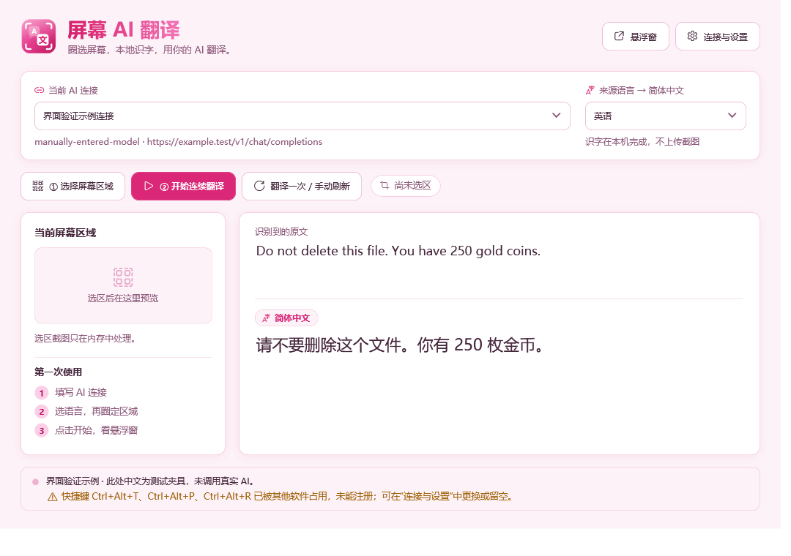

# 屏幕 AI 翻译 · 0.1.0 预览版

软件已做出可启动的候选版：在 Windows 电脑上圈选一块区域，本地识别英语、日语或韩语，再通过你填写的 AI 接口翻译成简体中文。主窗口和可拖动、置顶的悬浮窗都能显示原文与译文。

当前电脑的本地识字、两种接口的模拟测试、实际按钮流程和本机模拟持续运行已有验证。**真实 AI 服务、真实游戏、100% / 150% 缩放仍待验收。** 本版作为预览版发布；检查范围、已知问题与复测记录见 [发布检查](docs/发布检查.md)。



图中使用软件自带的示例文字和示例中文，展示界面布局，没有调用真实 AI。

## 第一步：启动

在仓库的 **Releases / 版本发布页** 下载附件：

| 文件 | 使用方法 |
|---|---|
| `ScreenTranslator-0.1.0-win-x64-Setup.exe` | 安装版，双击按向导安装，然后从开始菜单打开“屏幕 AI 翻译”；可选择创建桌面快捷方式 |
| `ScreenTranslator-0.1.0-win-x64-Portable.zip` | 免安装版，完整解压后双击 `ScreenTranslator/ScreenTranslator.exe` |
| `SHA256SUMS.txt` | 两个软件包与文件清单的校验值，可用 PowerShell 的 `Get-FileHash` 核对下载文件 |

两种下载都包含运行环境和英日韩识字模型，无需另装 .NET。安装版默认装到当前用户的 `%LOCALAPPDATA%/Programs/ScreenTranslator`，可在 Windows“已安装的应用”中卸载。卸载保留已经保存的连接；若需要完全清除本地数据，可在退出软件后删除 `%LOCALAPPDATA%/ScreenAiTranslator`。

软件和安装包尚未进行数字签名，Windows 可能显示未知发布者提示。请核对仓库来源和文件校验值，不需要关闭系统保护。

开发目录也可以直接双击 `artifacts/app/ScreenTranslator.exe`。

请保留 exe 所在的整个文件夹，运行需要其中的模型和配套文件。当前验证环境是 Windows 11 x64、125% 缩放。安装包允许 Windows 10 2004 及以上 x64 系统，但 Windows 10 和其他电脑尚未实测；本版不提供 ARM 安装。

## 第二步：填入 AI 连接

打开“连接与设置”。API 指软件调用 AI 的接口；不同服务可能用不同的请求格式。按服务提供者的说明填写：

| 输入 | 怎么填 / 为什么需要 |
|---|---|
| 连接名称 | 自己起名，例如“常用翻译”；可保存多套连接 |
| API 格式 | 选择 Chat Completions 或 Responses；它们是两种不同的文字接口格式 |
| 地址填写方式 | 通常选“基础地址”；服务给的是完整翻译路径时选“完整请求地址” |
| 服务地址 | 填入完整 `https://...` 地址，检查下方“最终请求”是否与服务文档一致 |
| 认证方式与密钥 | 默认 Bearer；服务要求 `x-api-key`、`api-key` 等头时选“指定密钥请求头” |
| 模型名称 | 直接手填即可，例如服务文档给的模型 ID；“获取列表”失败不影响手填 |
| 流式显示 | 让译文边生成边出现；服务不支持时取消勾选，使用完整返回 |

地址举例：基础地址 `https://example.com/proxy/v1/` 会变成 `https://example.com/proxy/v1/chat/completions` 或 `.../responses`。软件保留已有路径，不会自动添加 `/v1`。完整地址按原路径请求；查询参数的值在预览中隐藏。

远程服务需要 HTTPS；HTTP 和无认证模式仅允许明确填写的 `localhost` 或回环 IP 本机服务。遇到重定向时会停止，请填写服务的最终地址。

高级参数默认不用填。确有需要时，可声明输出限制字段、额外请求头和额外 JSON 参数；参数名必须符合对应服务。额外 JSON 不能覆盖模型、原文、翻译规则、流式开关和工具字段。这里用于参数设置，认证信息请填在密钥或额外请求头中。

点击“发送测试短句”会向当前服务发送：`Do not delete this file. You have 250 gold coins.` **这是真实请求，服务可能计费。** 检查是否得到中文，尤其是“不要删除”和数字 250，然后点击“保存并使用当前连接”。软件不会在启动时自动调用 AI。

## 第三步：选择文字并开始

1. 在主窗口选择英语、日语或韩语。
2. 点击“选择屏幕区域”，在同一块显示器内拖动框选文字；框旁会显示选区的像素尺寸。按 Esc 或点右键取消。
3. 点击“开始连续翻译”，查看主窗口或悬浮窗。
4. 暂时不用时点击“暂停”；关闭悬浮窗只会隐藏，关闭主窗口会结束采集和请求。

选区固定在屏幕位置。目标窗口移动、显示器配置或缩放改变后，需要重新选区。首版不跟随目标窗口，也不允许跨屏选区。最大选区为 1,600 万像素，单边最多 8,192 像素；过大时请缩小到实际文字区域。

OCR 指“从图像里读出文字”，这一步在电脑上完成，不上传截图。默认每轮约 750 毫秒，连续两次读到相同文字后才翻译；同字成功后不反复发送。模型或连接改变时会暂停并清理旧任务。

“翻译一次 / 手动刷新”可在暂停时完成一次翻译，也可强制重译当前区域。**手动刷新会重新发送请求**，不会因为已有缓存而省略。默认快捷键：选区 `Ctrl+Alt+T`，开始 / 暂停 `Ctrl+Alt+P`，隐藏 / 显示悬浮窗 `Ctrl+Alt+H`，刷新 `Ctrl+Alt+R`。冲突会显示在主窗口，可在设置中修改或留空关闭。

悬浮窗按住标题栏拖动、拖动边缘调整大小，可切换置顶、复制译文，点 × 隐藏；字号、不透明度和是否显示原文在设置中调整，设置页有实时预览。不透明度低于 100% 时能透出下方画面。

## 第四步：判断问题出在哪里

先对照“识别到的原文”。原文读错时，调整选区、字号、窗口模式或来源语言；原文正确而中文错误时，检查 AI 模型和返回内容。第一次试用建议从普通网页上的清晰横排短句开始，再试目标游戏。

| 现象 | 处理 |
|---|---|
| 原文为空 / 预览黑屏 | 重新选区；尝试目标应用的窗口或无边框模式。受保护画面或部分游戏可能无法捕获，当前尚未确认兼容 |
| 401 / 403 | 检查密钥、认证方式和模型权限；修正后重新开始 |
| 余额不足 | 软件会暂停；检查服务账户后重新开始 |
| 429 / 临时服务器错误 | 当前内容最多重试一次；长等待或仍失败时手动刷新，不会无限循环 |
| 超时 / 部分译文后断开 | 译文未完成，请手动刷新；软件不会盲目补发，取消也不能保证服务端停止计费 |
| 返回空译文 / 格式错误 | 检查 API 格式、完整地址和模型；服务不支持流式时关掉流式再试 |
| 缺少模型 / 模型加载失败 | 保留 `models/screen-ocr` 五个 onnx 文件及 manifest；开发目录可运行准备模型脚本 |
| 翻译窗口被读进选区 | 当前电脑排除测试已通过；其他环境排除失败时，将主窗口和悬浮窗移出选区 |

日语竖排、混合语言、艺术字体、快速滚动、复杂多栏和实际游戏尚未通过测试。OCR 自己读对普通样本，不代表所有场景都准确。

## 本地数据与配置备份

普通配置位于 `%LOCALAPPDATA%/ScreenAiTranslator/settings.json`。密钥、额外请求头和完整地址的查询值与普通配置分开，由 Windows 当前用户保护，位于 `credentials.dat`；读取或保护失败会报错，不会回退成明文。更换 Windows 用户或迁移电脑后需要重新填写密钥。

截图、原文、译文默认只留在内存；成功结果最多缓存当前会话的 200 条。诊断日志只记阶段、错误类别、编号和耗时，不记屏幕文字与密钥。字典缓存是公开模型的字符表，不是用户文字。

“导出配置”去掉密钥、额外请求头和地址查询值，适合备份普通参数。首版没有一键导入、历史记录或云同步。普通名称、模型名和额外 JSON 参数按普通配置保存。

## 开发与复测

源码分为 `Capture`（屏幕区域）、`Ocr`（本地识字）、`Translation`（两种接口）、`Session`（稳定、取消与缓存）、`Display`（窗口）和 `Settings`（配置与密钥）。工程位于 `src/ScreenTranslator.App`，必要测试位于 `tests/ScreenTranslator.Tests`。

构建所需依赖下载到项目的 `.tools`、`.nuget`、`models`。源码仓库不包含 SDK、NuGet 缓存或模型二进制；模型准备脚本会下载固定文件并核对校验值。在本目录 PowerShell 7.2 或更新版本运行：

```powershell
.\scripts\PrepareSdk.ps1
.\scripts\PrepareModels.ps1
.\scripts\Build.ps1 -Publish
```

软件图标的矢量源是 `src/ScreenTranslator.App/Themes/AppIcon.xaml`；修改后运行 `.\scripts\BuildIcon.ps1` 重新生成 `Assets/AppIcon.ico`（只用 Windows 自带组件），再构建。界面配色与控件样式集中在同目录的 `Theme.xaml`。

SDK 固定为 10.0.401，下载后核对官方 SHA512；模型核对固定 SHA256；NuGet 采用锁文件。没有系统 PATH 或全局安装改动。第三方版本与许可见 `THIRD_PARTY_NOTICES.md` 和 `licenses`。

制作同款安装版和免安装 ZIP：

```powershell
.\scripts\Package.ps1
.\scripts\TestPackage.ps1
```

`Package.ps1` 使用固定的官方 Inno Setup 7.1.0，首次将编译工具放到项目的 `.tools`，核对 SHA256 和数字签名；输出位于 `artifacts/releases`。`TestPackage.ps1` 在项目内的独立目录实际安装、验证两种下载并卸载，若已存在本软件的安装记录会停止，以保留现有安装。该测试使用独立的模拟设置，不调用真实 AI。

```powershell
.\scripts\Test.ps1 -Mode quick       # 三语 OCR 与接口 / 密钥；不调用真实 AI
.\scripts\Test.ps1 -Mode session     # 会话归属与去重，包含 60 秒观察
.\scripts\Test.ps1 -Mode desktop     # 本项目测试窗口的实际截图
.\scripts\Test.ps1 -Mode exclusion   # 覆盖窗口与实际悬浮窗的截图排除、快捷键冲突
.\scripts\Test.ps1 -Mode main-flow   # 主窗口按钮、单次翻译、暂停与关闭
.\scripts\Test.ps1 -Mode ui          # 隔离设置的界面预览（主窗口、设置、悬浮窗、选区遮罩）和模型加载
.\scripts\Test.ps1 -Mode soak        # 20 分钟本机模拟端到端；出现自带的测试窗口
```

所有这些测试使用原创合成文字和本机模拟回应，不证明任何真实供应商或游戏兼容。报告写入 `artifacts/verification`。当前下一道检查是：用你选择的实际 AI 接口完成英日韩短句核对，再在常用软件里亲手选区、开始、暂停，并反馈一项具体修改。
